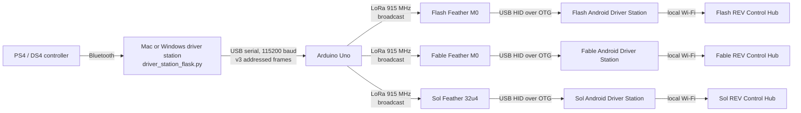
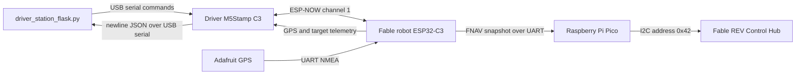

# Control System Architecture

## Purpose And Scope

This system gives one driver station long-range control of three robots while
preserving the normal FTC programming model on each REV Control Hub. The robot
OpModes still read ordinary `gamepad1` fields. The long-range transport is
inserted before the Android FTC Driver Station app by making a radio-connected
microcontroller appear to the phone as a USB gamepad.

The current fleet is:

| Robot | Primary role | Tele-op profile | Navigation |
| --- | --- | --- | --- |
| Flash | Drive, intake, and dump | Standard | None |
| Fable | Drive, intake, dump, and GPS navigation | Standard | Point-to-point GPS autonomy |
| Sol | Drive, turret, and shooter | Sol-specific | None |

FTC competition legality is not a design constraint for this personal project.
The priorities are long range, understandable failure behavior, low-cost
hardware, and compatibility with existing REV/FTC software.

## System At A Glance

There are two independent data planes:

1. The fleet tele-op plane carries addressed controller state over LoRa to all
   three robots.
2. The Fable navigation plane carries GPS telemetry and navigation commands
   over ESP-NOW, then exposes robot-side state to the Control Hub over I2C.

Keeping these planes separate prevents map telemetry and navigation commands
from disturbing the proven 20 Hz gamepad stream.

## Fleet Tele-Op Data Plane

### 1. Controller Input

The driver's PS4/DS4 controller connects to the desktop by Bluetooth. Pygame
reads sticks, triggers, face buttons, bumpers, and the D-pad. The desktop
application normalizes the controls into transport values:

- Sticks: signed integers from `-1000` to `1000`
- Triggers: unsigned integers from `0` to `1000`
- Buttons: a 16-bit bitmask
- Selected robot: a one-byte numeric ID

The application normally generates a frame at 20 Hz. The dashboard visualizes
the same normalized state before it is sent, which makes it possible to
separate controller/input problems from radio or HID problems.

On macOS, Pygame and SDL remain on the main thread because AppKit requires menu
and event initialization there. Flask and navigation serial processing run in
background threads. This threading boundary is intentional.

### 2. Addressed Binary Frame

The host builds a protocol `v3`, 21-byte frame. It includes robot ID `1`, `2`,
or `3` rather than a robot name. Names shown in the dashboard and transmit log
are local labels only.

The selected frame is sent over USB serial at 115200 baud to the Uno. Exact
field offsets and checksum coverage are defined in
[Protocol Reference](protocol.md#tele-op-lora-frame).

### 3. Uno Serial-To-LoRa Bridge

The Uno searches the serial stream for the two-byte magic, collects exactly 21
bytes, and validates the version and XOR checksum. A valid frame is transmitted
unchanged through the RFM95W at 915 MHz.

The Uno deliberately has no robot-specific control logic. New button meanings
usually do not require an Uno semantic change while the frame remains the same
size, but its framing and validation still need to be checked for every protocol
change.

### 4. Broadcast Reception And Filtering

All three robot radios hear the same LoRa transmission. Each Feather validates
the frame and compares the target byte with its compiled robot ID:

| ID | Receiver |
| --- | --- |
| `1` | Flash |
| `2` | Fable |
| `3` | Sol |
| `255` | All robots, reserved broadcast behavior |

Only the addressed receiver applies the state. Non-addressed receivers remain
neutral. Changing the selected robot therefore transfers the one live HID
control stream without transmitting robot names or maintaining three separate
radio links.

### 5. USB HID Injection

Each Feather is connected by USB OTG to the Android phone mounted on its robot.
It presents a gamepad report to Android:

- Flash and Fable use Adafruit Feather M0 RFM9x boards and TinyUSB.
- Sol uses an Adafruit Feather 32u4 RFM95 and the AVR HID stack.
- Flash and Fable expose analog Brake and Accelerator axes so FTC receives
  `left_trigger` and `right_trigger` as floats.
- Sol exposes its right trigger and D-pad in the Sol-specific report.

The Android FTC Driver Station app sees the Feather as a local USB controller.
It sends normal gamepad state over its short-range local Wi-Fi connection to
that robot's REV Control Hub. No LoRa-aware code is required in a normal tele-op
OpMode.

### 6. Tele-Op Failure Behavior

Each robot receiver has a 250 ms stale-frame timeout. If it has not received a
valid addressed frame by then, it sends a neutral HID report: centered sticks,
released buttons, and zero triggers.

This protects against a lost LoRa stream and against leaving the previously
selected robot under a stale command. It only governs HID output. Autonomous
code already running on a Control Hub can have different stop conditions.

## Multi-Robot Control Model

The driver selects Flash, Fable, or Sol from the dashboard or presses Space to
cycle through them. The Python application continues to broadcast one frame,
but the target byte changes. Each robot card and log is local dashboard state;
the RF payload carries only the numeric ID and controls.

Driver registration is also addressed. The dashboard briefly injects the
Options plus Cross registration combination for the selected robot. Each phone
must be registered separately because each Android Driver Station has its own
USB gamepad session.

Fable autonomous navigation can continue on its Control Hub while the LoRa
tele-op stream is retargeted to Flash or Sol. The driver station's Fable badge
keeps the operator aware of that background state. More detail is in
[Multi-Robot Operation](multi-robot.md).

## Fable Navigation Data Plane

### 1. Robot-Side Position Source

Fable's Adafruit GPS sends NMEA data by UART to the robot-side ESP32-C3. The C3
uses TinyGPSPlus to maintain current coordinates, satellite count, HDOP, data
age, and a coarse fix quality:

- `GOOD`: recent valid position with at least four satellites
- `WEAK`: recent valid position with fewer than four satellites
- `NONE`: no recent valid position

The navigation C3 is a sensor and transport sidecar. It does not drive motors.

### 2. Driver-To-Robot Commands

The desktop opens a second USB serial link to the visible driver-side M5Stamp
C3. It sends simple newline commands such as an integer E7 target or clear
request. That C3 wraps the command in a CRC-protected ESP-NOW packet and
broadcasts it on channel 1.

It also emits a heartbeat every 500 ms. The robot C3 reports whether a command
or heartbeat has been heard within two seconds. In the current Control Hub
implementation this link flag is diagnostic, not an autonomous motion interlock.

### 3. Robot-To-Driver Telemetry

The robot C3 sends a CRC-protected telemetry packet every 100 ms. It contains
current position, target position, sequence numbers, GPS quality, freshness,
and driver-link age. The driver C3 validates the packet and prints one JSON
object per line over USB serial. The Flask application updates the map and
status cards from those JSON messages.

The driver's C3 LED gives an ambient view of link health and packet activity.
See [Driver Navigation LED](driver-navigation-led.md).

### 4. Robot C3-To-Pico Snapshot

At 10 Hz, the robot C3 emits a fixed 56-byte `FNAV` snapshot over UART. The Pico
validates its CRC and publishes the latest complete snapshot as an I2C slave at
address `0x42`.

The Control Hub reads four 14-byte chunks. When register zero is selected, the
Pico latches a copy so all four reads belong to one snapshot and share one CRC.
This avoids mixing bytes from consecutive GPS updates.

### 5. Control Hub Navigation

The Fable robot project on branch `fable` configures a custom I2C device named
`FableNav`. Its navigation subsystem decodes the snapshot, applies freshness
and quality rules, and computes drive and turn output from GPS bearing plus IMU
heading.

Sending a target from the web dashboard stores a valid target, but it does not
by itself command the motors to move. The current Fable workflow requires the
driver to arm navigation with PS4 Cross, which appears to FTC as `gamepad1.a`.
Circle, meaningful manual drive input, target invalidation, stale data, or other
Control Hub safety logic exits navigation.

The desktop dashboard's autonomous mode is an operator-facing estimate. It
does not receive authoritative OpMode state from the Control Hub. Current
desktop logic clears that estimate when a meaningful Fable tele-op drive or
exit input is transmitted.

## Map And Field Calibration

The Fable dashboard uses Leaflet. It can display OpenStreetMap street tiles or
Esri satellite tiles, both of which require internet access at the driver
station. Field calibration stores four GPS corners in browser local storage.
Those corners may be typed, selected on the calibration map, or populated from
Fable's current received coordinate.

When calibrated, the main map fits the field polygon with a small buffer. When
not calibrated, it creates a faint square around the current GPS position as a
selection aid. The fallback square is a UI convenience, not a geofence or a
Control Hub constraint.

## Camera And Video Boundary

The current repository does not transport, stream, or process camera frames.
Any direct 5.8 GHz FPV camera-to-headset link installed on a robot is an
independent radio path with no connection to the LoRa gamepad protocol,
ESP-NOW navigation packets, Flask map, or Control Hub I2C snapshot.

A USB webcam may be physically connected to a REV Control Hub for FTC vision
experiments, but Fable's current point-to-point controller does not consume it
and does not perform obstacle avoidance. No camera feed is returned through the
desktop dashboard in the current architecture.

## Process And Connection Lifecycle

`driver_station_flask.py` is designed to start even when the controller, Uno,
or Fable navigation C3 is absent. The dashboard appears and the status
indicators show what is missing. Specified serial ports are retried periodically,
and controller discovery continues while the app is running.

This behavior supports bench setup in any power-up order. It does not make a
missing link safe to ignore: operators must confirm the relevant indicator
before commanding a robot.

## Safety Boundaries

| Boundary | Current protection | Important limitation |
| --- | --- | --- |
| Desktop to Uno | Reconnect loop and visible Serial status | No LoRa transmission while disconnected |
| LoRa to Feather | Magic, version, length, checksum, target filter | No return acknowledgement from each Feather |
| Feather HID | 250 ms neutral timeout | Does not stop autonomous Control Hub logic |
| Navigation ESP-NOW | CRC, sequence, telemetry, heartbeat age | Broadcast and unencrypted; heartbeat is currently diagnostic |
| C3 to Pico | Fixed length, magic, version, CRC | UART electrical/configuration errors stop updates |
| Pico to Control Hub | Latched snapshot and CRC | Correct hardware name/address are still required |
| Map UI | Target preview, field outline, explicit Send Target | Calibration is not a geofence |

The operator must cancel Fable autonomy or stop its OpMode before shutting down
the desktop application. `Ctrl-C` is not a reliable autonomous emergency stop.

## Change Ownership

Exact deployment destinations and wiring are in
[Deployment Reference](deployment.md). Exact bytes are in
[Protocol Reference](protocol.md). Agent coupling and documentation rules are
in the root [Agent Maintenance Guide](../AGENTS.md).

The architectural rule to preserve is simple: LoRa owns addressed human gamepad
state, while Fable's navigation side channel owns coordinates, targets, and
telemetry. Any proposal that crosses that boundary should be treated as a
system redesign and validated end to end.
